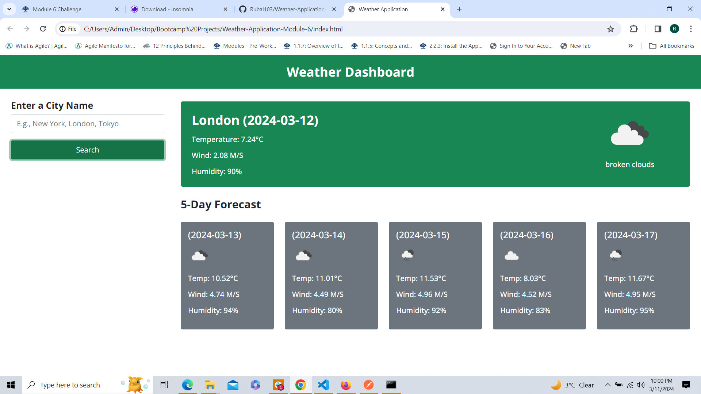

# Weather-Application-Module-6

## A Weather Application to see current weather conditions and forecast using OpenWeather API

### This Weather app has been created using HTMl, JavaScrpit, CSS

### Weather Application allows the user to search for weather conditions of a place that they input

### OpenWeather API has been used to fetch latitude, longitude and weather conditions in real time. 

### Application also let the user see forecast for the same place. 

### Images showing working of the Application

